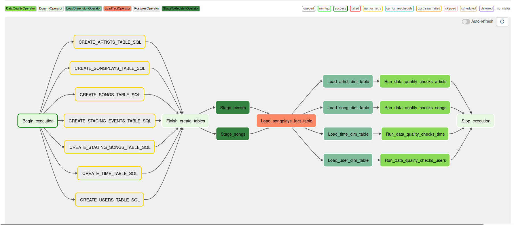

# A data pipeline project using Apache Airflow and Amazon Redshift.

The pipeline orchestrates data load from Amazon S3 to Redshift stage, fact and dimensions tables. 

<p align="center"></p>


## DAGS



### Table of Contents

1. [Installation](#installation)
2. [Project Motivation](#motivation)
3. [File Descriptions](#files)
4. [Licensing, Authors, and Acknowledgements](#licensing)

## Installation <a name="installation"></a>

1. The project can be run in any environment that has Docker Engige and Docker Compose installed.

   Code has run sucessfully on Ubuntu Desktop 20.
   
   ``` sudo docker-compose up```

## Project Motivation<a name="motivation"></a>

The main goal of this project is to build a end-to-end Data pipeline using Apache Airflow
following the steps below:

1. Load json files from Amazon S3 to Redshift stage tables.
2. Transform data from Redshift stage tables to fact and dimension tables
3. Execute data quality checks

**Technical details*: 
The project mainly uses Apache Airflow and Amazon Redshift. 

TODO: Describe Custom Operators

## File Descriptions <a name="files"></a>

**DAG** 
Folder with the main Airflow DAG that is triggered when Airflow starts running.

## Future works

Create AWS cloud formation templates to automate provision of Redshift Cluster

## Licensing, Authors, Acknowledgements<a name="licensing"></a>

Must give credit to Udacity for the Sparkify dataset that is provided
on Udacity's Data Engineer Nanodegree.

Otherwise, feel free to use the code here as you would like! 
